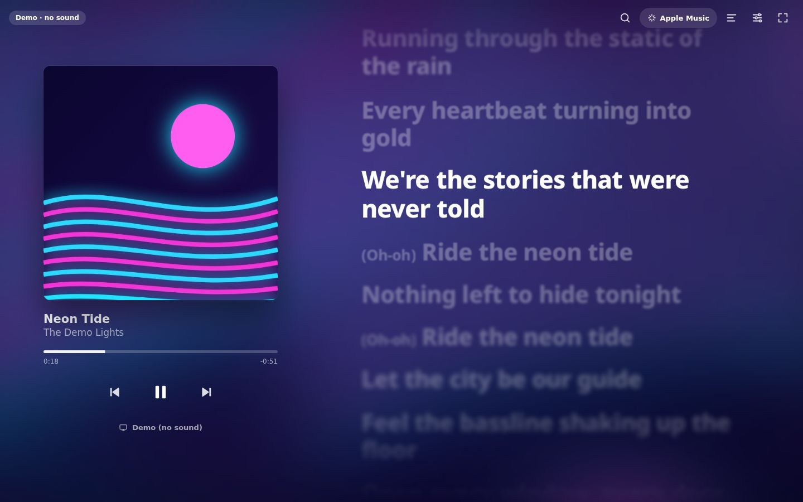
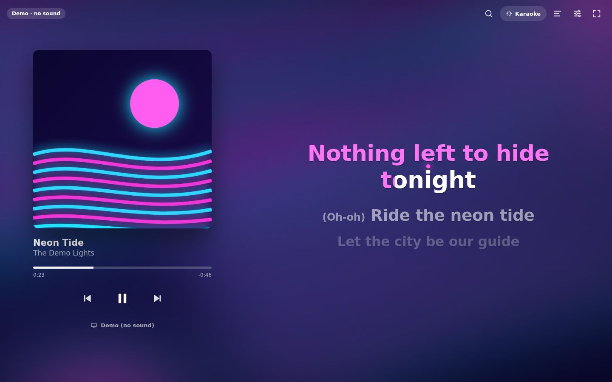
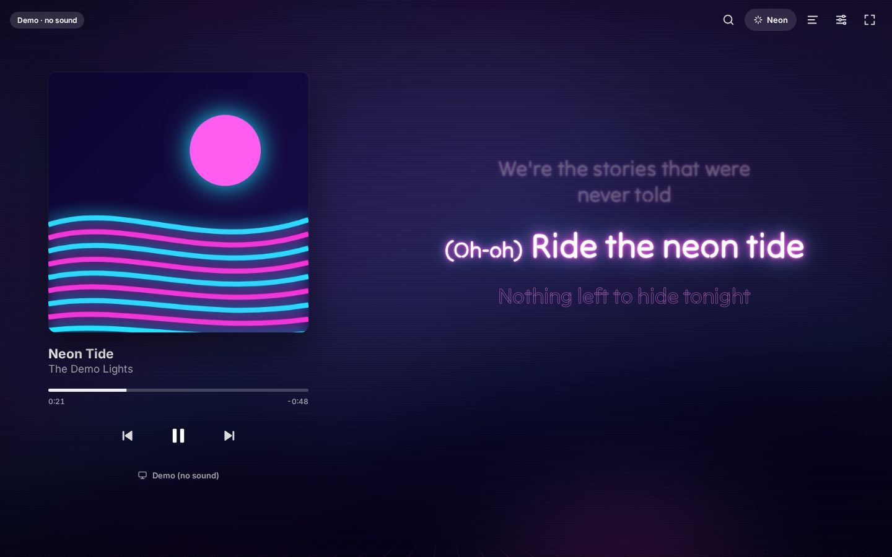
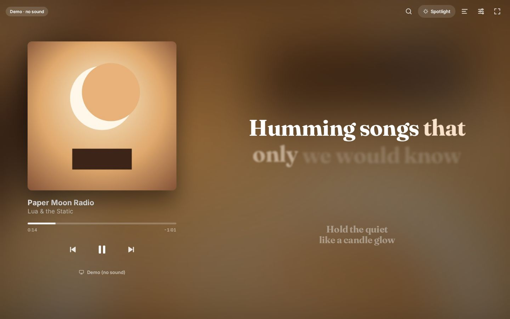
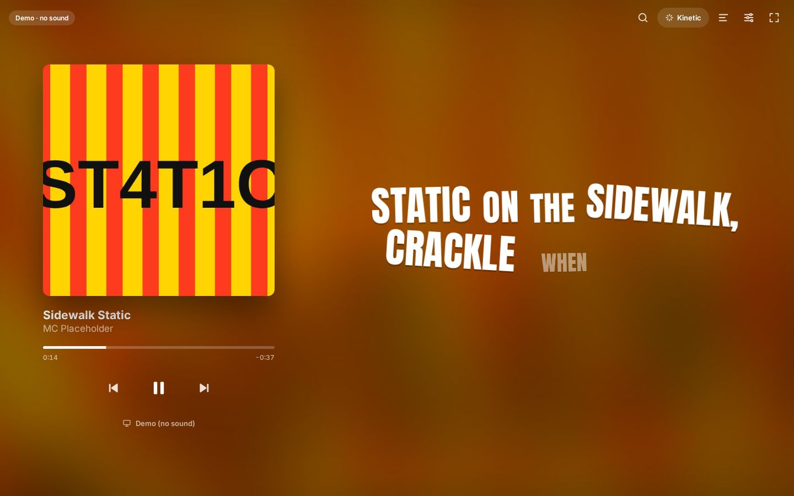

# Lyrics Stage

**Apple Music–style animated lyrics for whatever you play on Spotify.** Get it as a **desktop app** (macOS, Windows,
Linux) that follows the Spotify app you're already logged into, or as an **Android app** (see [docs/ANDROID.md](docs/ANDROID.md)). There's no Spotify developer account to set up, and
Spotify's **Automix** and **Crossfade** work. Lyrics styles and colors adapt to each song, and when Spotify blends two
songs together, the lyrics blend too.



| Karaoke | Neon | Spotlight | Kinetic |
| --- | --- | --- | --- |
|  |  |  |  |

> The screenshots come from the built-in **demo mode**. The demo songs and lyrics are made up.

## What it does

- **Apple Music–style lyrics.** Big bold lines. Words light up as they're sung, held notes glow, and lines glide into
  place one after another. Tap a line to jump to it, or scroll to look around.
- **Five styles, plus Auto.** Apple Music, Karaoke (with a bouncing ball), Neon, Spotlight and Kinetic. **Auto** picks
  one for each song based on how fast the words come and how colorful the cover is.
- **Adapts to each song.** Colors come from the album cover. The background and scrolling move faster for energetic
  songs and slower for calm ones.
- **Adapts to Spotify Automix & Crossfade.** The app spots when songs overlap and crossfades the lyrics and background
  over the same length of time. The old song's lyrics keep moving in time while they fade out, and the two album covers
  merge into one.
- **A visualizer in the instrumental breaks.** Instead of three dots, moving bars in the album's colors keep the beat
  while the singing pauses, with a thin line showing when the lyrics come back. (Prefer dots? Settings → Instrumental
  breaks.)
- **A beat flash you can choose.** On strong beats in the split-second pauses between lines, pick how it looks in
  Settings → Beat flash: a soft **glow**, a **full-screen** color wash, lit **edges**, a little **kick** of the lyrics,
  or off. At most three flashes a second, soft and tinted (never white), and off with Reduce motion. With the PC's
  real sound (Windows), every bass beat glows even while someone is singing, not only in the pauses.
- **A scene for songs without lyrics.** Instrumentals and songs LRCLIB doesn't have show an orb or a mirrored
  equalizer in the album's colors that punches on every beat; big beats send a shockwave across the screen
  (Settings → Songs without lyrics).
- **Follows your PC's real sound (Windows desktop app).** The bars, the flash and the scene can hit the real beat. They
  only react while the song is actually playing, so a video or a ping can't set them off while Spotify is paused.
- **Works with right-to-left lyrics** such as Arabic and Hebrew.
- **A demo mode** to try every style without Spotify.

## Get the desktop app (recommended)

1. Download the installer for your system from the **[Releases page](https://github.com/xbyxr9/spotifylyrics/releases)**,
   or build it yourself (see below).
2. Open **Spotify** and log in as usual. Then open **Lyrics Stage** and play a song.
3. Want Automix? In Spotify: **profile picture → Settings → Playback → Automix** (Premium).

On macOS, click **OK** when asked to let Lyrics Stage control Spotify. The installers aren't code-signed yet, so the first
launch needs an extra click (right-click → Open on macOS; "More info → Run anyway" on Windows).

From version 0.2.0 on, the app updates itself on Windows and Linux (AppImage): new versions download in the background
and install when you restart it. On macOS it tells you when a new version is out.

Prefer Spotify's own data? **Settings → Spotify connection → Sign in with Spotify** uses the Spotify Web API instead:
exact timing and covers, and it follows your phone or speakers too. It needs a free Spotify developer app (one-time
setup, see [docs/DESKTOP_APP.md](docs/DESKTOP_APP.md#sign-in-with-spotify-optional)).

Run it from the source code:

```bash
git clone https://github.com/xbyxr9/spotifylyrics.git
cd spotifylyrics
npm install
npm run app:start      # build and open the app
npm run app:build      # or: make an installer in release/
```

Everything about the app, including the Linux timing note and how to publish installers, is in
**[docs/DESKTOP_APP.md](docs/DESKTOP_APP.md)**.

## Android

There's an **Android app** too: download `Lyrics-Stage-<version>-android.apk` from the
[latest release](https://github.com/XBYXR9/Lyrics-Stage/releases/latest) and install it. The Spotify app plays the music
and Lyrics Stage shows the lyrics next to it (or on a tablet, or while the music plays on another device). It signs in
with Spotify like the web version. [Full guide: docs/ANDROID.md](docs/ANDROID.md).

## Or use the web version

The web version runs in your browser at http://127.0.0.1:5173. It uses the Spotify Web API, so it can follow **any**
device, including your phone, and it can play music in the browser. The catch: you create a (free) Spotify developer
app first, and Spotify limits those to 5 users.

```bash
npm install
npm run dev
```

The page walks you through it. Full guide: **[docs/SETUP.md](docs/SETUP.md)**. Just want to look around? Click
**Try the demo**.

| | Desktop app | Web version |
| --- | --- | --- |
| Setup | None — uses your Spotify app | Create a Spotify developer app |
| Automix | ✅ (Spotify's own) | ✅ when playing from a Spotify app, ❌ in-browser player |
| Follows your phone | ❌ (only the Spotify app on the same computer) | ✅ |
| Search | Opens in Spotify | Search and play inside the page |

## Using it

- Play a song in any Spotify app and it appears on the page. You can also press <kbd>/</kbd> to search.
- Click the style button at the top (or press <kbd>Y</kbd>) to switch styles.
- Open **Settings** (<kbd>S</kbd>) to change text size, the word highlight, the background, the transitions and the
  lyrics timing. If the lyrics feel late (Bluetooth headphones add a delay), press <kbd>]</kbd> to show them earlier.

| Key | Action |
| --- | --- |
| <kbd>Space</kbd> | Play / pause |
| <kbd>N</kbd> / <kbd>P</kbd> | Next / previous song |
| <kbd>/</kbd> | Search |
| <kbd>S</kbd> | Settings |
| <kbd>Y</kbd> | Next lyrics style |
| <kbd>L</kbd> | Lyrics only (hide the player) |
| <kbd>F</kbd> | Fullscreen (the buttons fade out until you move the mouse) |
| <kbd>−</kbd> / <kbd>+</kbd> | Spotify volume down / up |
| <kbd>[</kbd> / <kbd>]</kbd> | Show lyrics 0.1s later / earlier (every song) |
| <kbd>,</kbd> / <kbd>.</kbd> | Show lyrics 0.5s later / earlier for this song only (<kbd>&lt;</kbd> / <kbd>&gt;</kbd>: 0.1s), e.g. after an Automix |

## How it works (short version)

- **Desktop app:** reads what the Spotify app is playing through your operating system (AppleScript on macOS, media
  controls on Windows, MPRIS on Linux) about 4 times a second, and sends play/pause/skip/seek back the same way. It
  never asks for your Spotify password.
- **Web version:** logs in with Spotify's PKCE flow (no secret or server) and checks the Web API about once a second.
- **Lyrics:** from [LRCLIB](https://lrclib.net), a free and open database of time-synced lyrics. When a song only has
  line timing, the app estimates the timing of each word.
- **Automix detection:** Spotify doesn't say when Automix is happening, but the timing gives it away. If the next song
  starts while the current one still has time left, or starts part-way in, it's a blend.

Details: **[docs/HOW_IT_WORKS.md](docs/HOW_IT_WORKS.md)**.

## Project layout

```
electron/         the desktop app: window, and bridges to the Spotify app (bridge/mac|windows|linux.ts)
src/
  lib/            logic: engines (desktop, Web API, demo), clock, Automix detection,
                  lyrics lookup & parsing, color palette, song "vibe"
  components/     React UI: stage, player panel, search, settings, background
    styles/       the lyric styles (Apple Music, Karaoke, Neon, Spotlight, Kinetic)
  styles/         CSS
scripts/          app build/dev scripts, and a fake Spotify for Linux development
docs/             guides and screenshots
```

## Contributing

Ideas, bug reports and new lyric styles are welcome. See **[CONTRIBUTING.md](CONTRIBUTING.md)**. If you want to add a
style, start with **[docs/ADDING_A_STYLE.md](docs/ADDING_A_STYLE.md)**.

```bash
npm run app:dev    # the desktop app with live reload
npm run dev        # the web version
npm test           # run the unit tests
npm run typecheck  # check types
```

## Limits

- **Automix and Crossfade need Spotify Premium**, and Automix only works on some playlists. That's Spotify's rule.
- **Desktop app on Linux:** Spotify's Linux app doesn't share the song position, so timing is estimated from the start
  of each song. Click a lyric line to sync.
- **Web version:** controlling playback needs Premium, and developer apps are limited to 5 Spotify accounts.
- Some songs have no lyrics on LRCLIB yet. You can add them at [lrclib.net](https://lrclib.net).
- Spotify doesn't share Automix transition points, so blends are detected from timing.

## Credits & license

- Lyrics: [LRCLIB](https://lrclib.net), a community project. Please be kind to their servers.
- Backup album covers (desktop app, when Spotify doesn't share one): Apple's iTunes Search API.
- Not affiliated with, or endorsed by, Spotify or Apple. "Apple Music" describes the visual style only.

[MIT](LICENSE)
